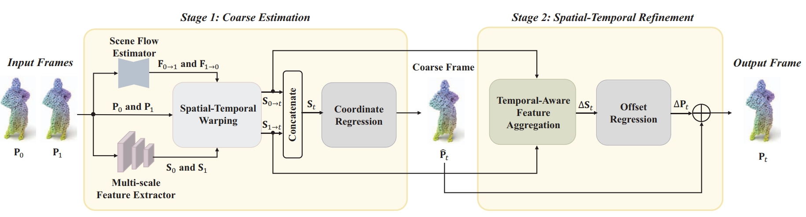
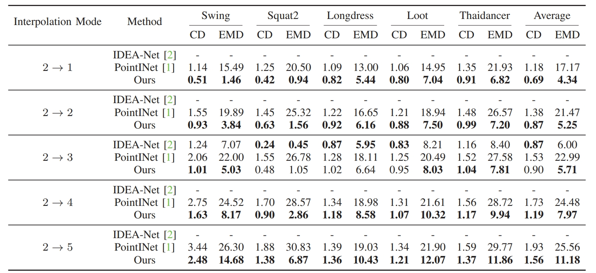
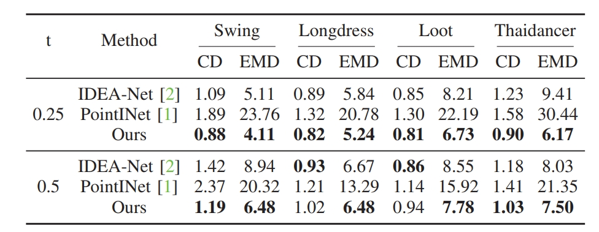

# SR-Net
This repository contains Pytorch implementation of **Spatial-Temporal Consistency Refinement Network for Dynamic Point Cloud Frame Interpolation** (ICMEW 2023) by Ren L, Zhao L, Sun Z, Zhang Z and Chen J.[(Paper)](https://ieeexplore.ieee.org/document/10222006)
## Introduction
 
In this paper, we organically combine scene flows and features to propose a two-stage network based on residual-learning, which can generate spatially and temporally consistent interpolated frames. At the **<font color=Red>Stage 1</font>**, we propose the spatial-temporal warping module to effectively integrate multi-scale local and global spatial features and temporal correlation into a fusion feature, and then transform it into a coarse interpolated frame. At the **<font color=Red>Stage 2</font>**, we introduce the residual-learning structure to conduct spatial-temporal consistency refinement. A temporal-aware feature aggregation module is proposed, which can facilitate the network adaptively adjusting the contributions of spatial features from input frames, and predict the point-wise offset as the compensations due to coarse estimation errors. 

## Results
We compared our model with [PointINet](https://www.engineeringvillage.com/app/doc/?docid=cpx_32d64213180f209ab7cM76fe10178163134&pageSize=25&index=1&searchId=9beda5bd86214bb1a5cc12b1f41269ff&resultsCount=2&usageZone=resultslist&usageOrigin=searchresults&searchType=Quick) and [IDEA-Net](https://ieeexplore.ieee.org/document/9880149) on CD and EMD.
<div align="center">

</div>

<div align="center">

</div>

## Video Demo
We provide a video demo to verify the spatial-temporal consistency of our proposed method. 
<div align="center">

</div>


## Usage
### Requirements
Our code is developed and tested on the following environment:

* Python 3.7
* PyTorch 1.7.0
* Cuda 10.1
* Numpy 1.19

And we utilized open source pointnet2 to implement our code: [Pointnet2](https://github.com/sshaoshuai/Pointnet2.PyTorch/issues)

### Dataset

We processed the point cloud sequences of [MITAMA dataset](https://ieeexplore.ieee.org/document/9880149) and [MPEG-PCC](https://mpeg-pcc.org/index.php/pcc-content-database/) and [8i Lab](http://plenodb.jpeg.org/pc/8ilabs/) to obtain the [dataset](https://pan.baidu.com/s/1TndzM3W2ZAFp8bH0E_5QzA?pwd=zfym) for training and testing of our model.

### Train
Our model training process can be divided into two steps: Initial training on MITAMA dataset and finetuning on 8IVSLF dataset.

To train on **MITAMA** dataset, please set the parameters(train_root, npoints, save_dir, etc.) and run train.py

To finetune on **8IVSLF** dataset, please set the parameters(train_root, npoints, save_dir, etc.) and run finetune.py

### Inference
We provide our pretrained model for inference. 

To evaluate a pre-trained SR-Net on MITAMA dataset with single GPU, run:
```[python]
python test.py --test_root path\to\testdataset --pretrain_model path\SRmodel\model_for_mitama.pth 
```
To evaluate a pre-trained SR-Net on 8IVSLF dataset with single GPU, run:
```[python]
python test.py --test_root path\to\testdataset --pretrain_model path\SRmodel\model_for_8ivslf.pth 
```


